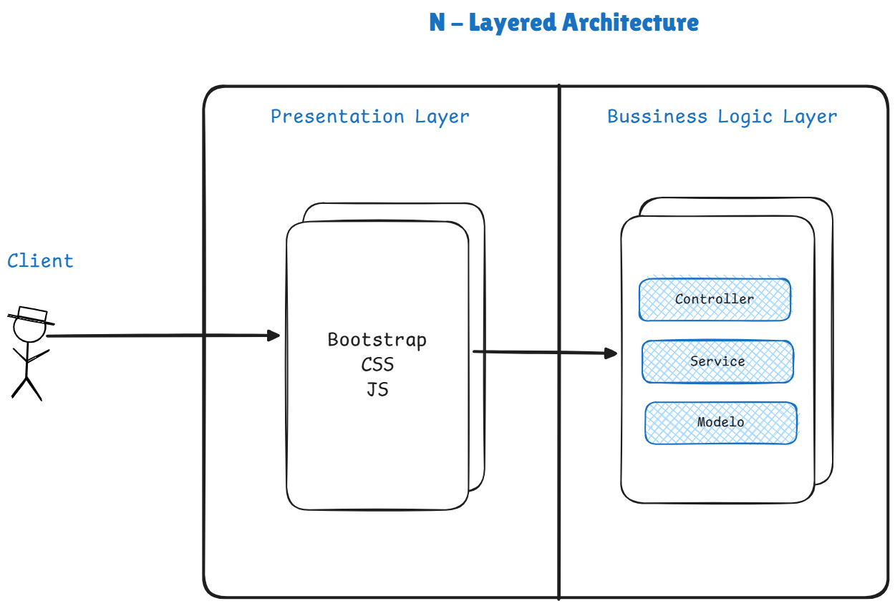

# Pico y Placa Backend

This project is an application designed to predict whether a vehicle can circulate based on the **“Pico y Placa”** restrictions. The prediction is determined by the day of the week, the vehicle's license plate number, and the time of day.

## Table of Contents

1. [Technologies Used](#technologies-used)
2. [Architecture](#architecture)
3. [Project Structure](#project-structure)
4. [Prerequisites](#prerequisites)
5. [Installation](#installation)
6. [Configuration](#configuration)
7. [Running the Application](#running-the-application)
8. [API Documentation](#api-documentation)
9. [Automated Testing](#automated-testing)


## Technologies Used

- **Java**: Primary programming language.
- **Spring Boot**: Framework for building the backend application.
- **JUnit 5 & Mockito**: For unit and integration testing.
- **Maven**: Dependency management and build tool.

## Architecture

The application follows a **N-layered architecture**, ensuring separation of concerns and scalability.



### Key Layers

- **Controller**: Handles incoming HTTP requests and responses.
- **Service**: Contains the business logic for predicting restrictions.
- **Model**: Defines data structures for requests and responses.
- **Exception**: Manages custom exceptions and global error handling.
- **Utils**: Provides utility functions such as date parsing and validation.

## Project Structure

```
Pico-Plate-Backend/
│
├── src.
│ ├─── main.
│ │ │ ├─── java.
│ │ │ │ └─── org.stackbuilder
│ │ │ │ ├─── controller         # REST API drivers.
│ │ │ │ ├─── exception          # Custom exceptions and global handling.
│ │ │ │ ├─── model              # Data models (requests/responses).
│ │ │ │ ├─── service            # Business logic (services).
│ │ │ │ └─── utils              # Utilities (date parse, validation).
│ │ └─── resources              # Static resources and configurations.
│ └─── test
│ └─── java                     # Unit and integration tests.
└─── .idea                      # Project configuration for IDEs.
```

## Prerequisites

Before you begin, ensure you have met the following requirements:

- **Java Development Kit (JDK) 17 or higher**: [Download JDK](https://www.oracle.com/java/technologies/javase-jdk17-downloads.html)
- **Maven**: Ensure Maven is installed and configured. [Maven Installation Guide](https://maven.apache.org/install.html)

## Installation

1. **Clone the Repository**

   ```bash
   git clone https://github.com/RicardoCR98/Pico-Placa-Predictor.git
   cd Pico-Plate-Predictor
   ```

2. **Build the Project**

   Use Maven to build the project and download dependencies.

   ```bash
   mvn clean install
   ```

## Configuration

1. **Application Properties**

   The application uses `application.yml` for configuration. You can find it under `src/main/resources/`. You can change the port if you want
   ```properties
   # Server Configuration
   server:
    port: 8080
   ```
## Running the Application

You can run the application using Maven or your preferred IDE.

### Using Maven

```bash
mvn spring-boot:run
```

### Using the Executable JAR

After building the project, you can run the JAR file.

```bash
java -jar target/Pico-Plate-Backend-0.0.1-SNAPSHOT.jar
```

### Accessing the API

Once the application is running, access the API at `http://localhost:8080`.

## API Documentation

### Endpoint: Predict Circulation

- **URL**: `http://localhost:8080/predict`
- **Method**: `POST`
- **Description**: Predicts whether a vehicle can circulate based on the license plate number, date, and time.

#### Request Body

```json
{
  "licensePlateNumber": "ABC-1234",
  "date": "27-04-2024",
  "time": "08:30"
}
```

- **licensePlateNumber**: `String` - The vehicle's license plate number.
- **date**: `String` (dd-MM-yyyy) - The date to check.
- **time**: `String` (HH:mm) - The time to check.

#### Response

If the response is TRUE:
```json
{
  "canDrive": true,
  "message": "The vehicle with plate number ABC-1234 is ALLOWED to drive on SATURDAY at 08:30."
}
```
If the response is FALSE:
```json
{
  "canDrive": false,
  "message": "The vehicle with plate number ABC-1234 is RESTRICTED from driving on 27-04-2024 at 08:30."
}
```

- **canDrive**: `Boolean` - Indicates if the vehicle can circulate.
- **message**: `String` - Detailed message about the restriction status.

#### Example using `curl`

```bash
curl -X POST http://localhost:8080/predict \
     -H "Content-Type: application/json" \
     -d '{
              "licensePlateNumber": "ABC-1234",
              "date": "27-04-2024",
              "time": "08:30"
         }'
```

## Automated Testing

The project includes comprehensive automated tests to ensure functionality and reliability.

### Testing Tools

- **JUnit 5**: For writing and running tests.
- **Mockito**: For mocking dependencies.
- **Spring Test**: For integration testing with the Spring context.

### Running Tests

Execute the following Maven command to run all tests:

```bash
mvn test
```

### Test Cases

1. **Vehicle Restricted During Prohibited Hours and Days**
    - Ensures that a vehicle is correctly identified as restricted when its license plate ends with a restricted digit on a restricted day and during restricted hours.

2. **Unrestricted Vehicle Outside of Prohibited Hours**
    - Verifies that a vehicle is allowed to circulate if the time is outside the restricted hours, even on a restricted day.

3. **Vehicle Not Restricted on Weekends**
    - Confirms that vehicles can circulate freely on Saturdays and Sundays, regardless of the license plate number.

4. **Invalid License Plate Handling**
    - Tests the application's response to invalid license plate formats or missing data.

5. **Handling of Blank Inputs**
    - Checks the application's behavior when license plate number, date, or time fields are blank or null.
